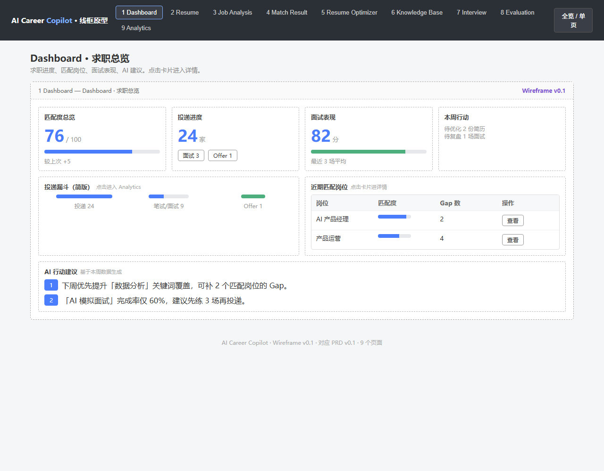
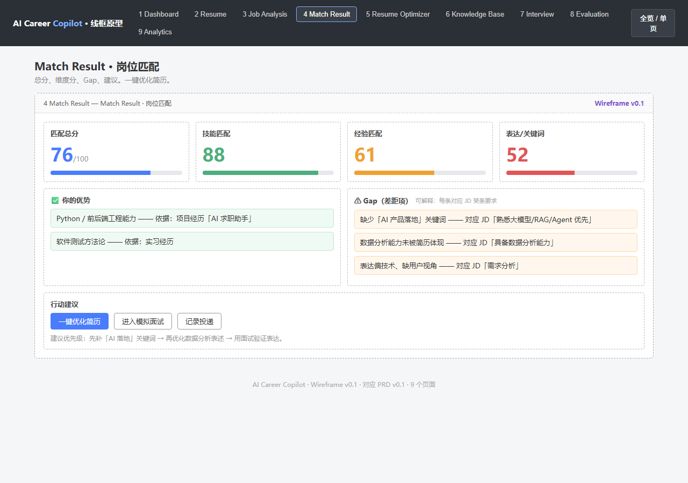
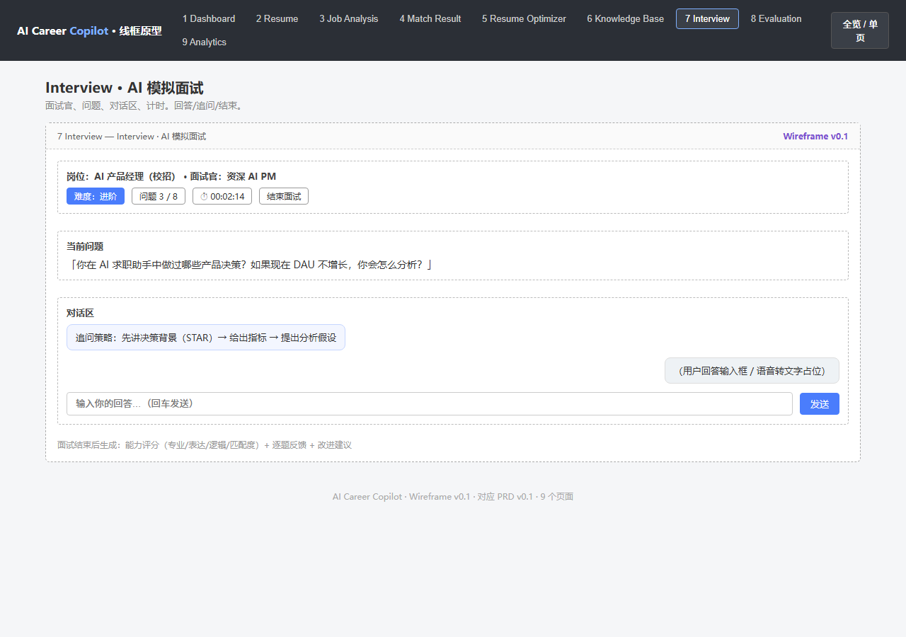
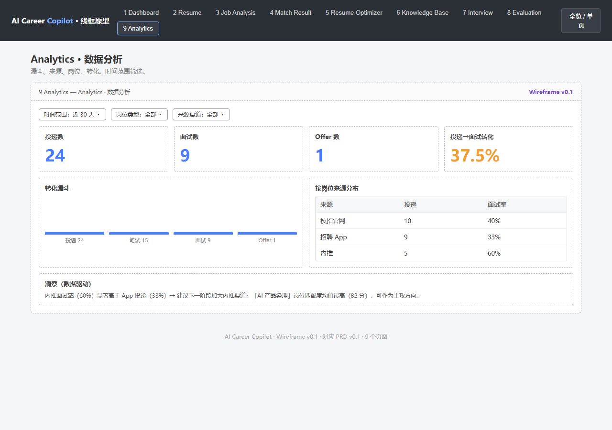
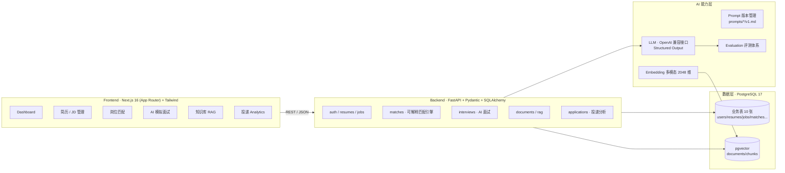

# AI Career Copilot · AI 求职决策与面试助手

> **面向中国应届生的、以"可解释匹配 + 数据复盘"为核心的 AI 求职决策与面试助手**
>
> 一个从 0 到 1 完成的求职作品集主项目：完整走通 **发现问题 → 用户研究 → 产品设计 → AI 方案 → 开发 → Evaluation → 数据分析 → 迭代** 的能力闭环。
>
> 目标岗位：**AI 产品经理 / AI 产品运营**


---

## 📌 项目简介

2026 届高校毕业生规模达 **1270 万**，本科生平均投 **46 份简历**才获得 1 次面试，超 **60%** 企业使用 ATS 机器初筛简历。应届生的核心痛点不是"不会找工作"，而是**不知道该投什么、简历差在哪、面试怎么练、复盘怎么做**。

本项目不是"AI 帮你找工作"，而是用真实的求职问题，构建一个可运行、可评测、可解释的完整产品，证明产品经理 / 产品运营的核心能力：

| 能力环节 | 本项目的对应产出 |
|---|---|
| 发现问题 | 桌面调研 + 用户研究（3 类用户画像，3 个核心痛点） |
| 用户研究 | `docs/user-research.md`：1270 万毕业生 / 46 份简历 1 次面试 / ATS 通过率 13.5% |
| 产品设计 | `docs/PRD.md` + 9 页线框原型 + 10 张表数据库设计 |
| AI 方案 | LLM Structured Output 解析 + 可解释匹配引擎 + RAG 知识库 |
| 开发 | 前后端分离全栈实现（FastAPI + Next.js），28 个 API 路由 |
| Evaluation | 16 条测试集 + 五模块量化评测（准确率 / 幻觉率 / 延迟 / 成本） |
| 数据分析 | 投递→面试→Offer 漏斗可视化 + AI 行动建议 |
| 迭代 | Prompt 版本管理 + 评测驱动迭代 |

---

## ✨ 核心功能

| 模块 | 功能 | 亮点 |
|---|---|---|
| 📄 简历管理 | PDF / 文本上传、结构化解析、版本管理、删除 | 结构化输出教育/技能/项目/经历 JSON |
| 🔍 JD 分析 | 粘贴 JD → 结构化抽取岗位/技能/经验/关键词 | 招聘意图解读 |
| 🎯 岗位匹配 | 匹配总分 + 维度分 + 优势 + Gap 清单 + 行动建议 | **可解释匹配**：规则打分（可复算）+ LLM Gap 分析（可溯源） |
| 🎤 AI 模拟面试 | 按 JD+简历出题、连续追问、结构化评分复盘 | 四维能力评分 + 逐题反馈 + 改进建议 |
| 📚 RAG 知识库 | 文档上传 → 切分 → Embedding → pgvector 检索 → 带引用回答 | 检索不到时明示"未找到"，不编造 |
| 📮 投递管理 | 记录投递状态、漏斗可视化、数据复盘 | 投递→面试→Offer 全链路 |
| 📊 Dashboard | 求职总览 + 投递漏斗 + 近期岗位 + AI 行动建议 | 一屏掌握全局，空状态引导 |

---

## 🖼️ 产品原型（Wireframe）

9 个页面的线框原型（`docs/prototype.html`），对应 PRD v0.1：

| 核心页面 | 预览 |
|---|---|
| Dashboard · 求职总览 |  |
| Match · 岗位匹配结果 |  |
| Interview · AI 模拟面试 |  |
| Analytics · 投递数据分析 |  |

---

## 🏗️ 系统架构



**技术栈**

| 层 | 技术 |
|---|---|
| 前端 | Next.js 16（App Router）· React 19 · TypeScript · Tailwind CSS 4 |
| 后端 | FastAPI · Pydantic v2 · SQLAlchemy 2.0 · JWT 认证 · bcrypt |
| 数据 | PostgreSQL 17 · pgvector · JSONB（结构化 AI 输出） |
| AI | 火山方舟 OpenAI 兼容接口 · Structured Output · Prompt 版本管理 · Embedding（2048 维） |
| 部署 | Docker Compose（db + backend + frontend 一键启动）· Dockerfile |

---

## 🔧 技术亮点

1. **LLM Structured Output 稳定解析**：简历 / JD 非结构化文本 → 严格 JSON Schema 输出 + JSON 校验，替代脆弱的规则引擎（关键词抽取复杂多变）。
2. **可解释匹配引擎**：规则打分（四维加权，可复算、可解释）+ LLM Gap 分析（每一条结论可溯源到简历哪段经历 / JD 哪条要求），"不给只读百分比的结果"。
3. **RAG + pgvector 知识库**：文档切分（500~800 tokens）→ 多模态 Embedding（2048 维）→ Top-K 检索 → 带来源引用的回答；**检索不到时明示"未找到"，不编造**，并对幻觉率进行量化评测。
4. **Evaluation 评测体系**：内置测试集 + 一键评测脚本，量化指标：准确率 / 召回率 / F1 / 幻觉率 / p50-p99 延迟 / Token 成本，驱动 Prompt 与模型迭代。

---

## 📊 Evaluation 评测结果（v1.0 首轮基线）

内置 `tests/eval/` 测试集，通过 `scripts/run_eval.py` 一键运行，输出结构化报告。首轮基线（16 个用例）：

| 模块 | 用例数 | 关键指标 | 说明 |
|---|---|---|---|
| 简历解析 | 3 | 字段准确率 60% · 技能 F1 0.41 | LLM 抽取基线 |
| JD 解析 | 3 | 字段准确率 66.7% · 技能 F1 0.33 | 标题/学历/经验识别较好 |
| 岗位匹配 | 4 | 等级命中 50% | 规则打分可复算，LLM 解释待优化 |
| RAG | 4 | 检索准确率 75% · **引用准确率 100%** · 幻觉率 25% | 引用溯源已达标，检索待优化 |
| AI 面试 | 2 | 追问达标 100% · 评分生成 100% | 流程闭环已跑通 |

> 说明：这是首轮基线数据，用于建立"可量化的质量底线"，后续按 准确率 / 幻觉率 / 延迟 / 成本 四个维度持续迭代（详见 `tests/eval/reports/`）。

---

## 🚀 快速开始

### 方式一：Docker 一键部署（推荐）

```bash
cd ai-career-copilot
cp .env.example .env      # 填入 LLM_API_KEY
docker compose up --build -d
```

- 前端：http://localhost:3000
- 后端 API 文档：http://localhost:8000/docs
- PostgreSQL（含 pgvector）：localhost:5432

### 方式二：本地开发

```bash
# 1. 后端（Python 3.13+，先建库：db/schema.sql）
cd backend
python -m venv .venv && .venv\Scripts\activate
pip install -r requirements.txt
uvicorn app.main:app --reload      # http://localhost:8000/docs

# 2. 前端（Node 20+）
cd frontend
npm install
npm run dev                        # http://localhost:3000
```

Windows 也可直接运行 `start.bat` 一键启动。

### 运行评测

```bash
cd backend
python ../scripts/run_eval.py      # 输出 tests/eval/reports/eval_*.json
```

---

## 📁 项目结构

```
├── frontend/        # Next.js 16 前端（dashboard/resumes/jobs/matches/interview/knowledge/applications）
├── backend/         # FastAPI 后端（api/core/models/schemas/services 分层）
├── ai/              # prompts（版本管理）/ parsers / evaluators
├── rag/             # 文档切分 / 检索 / Embedding（pgvector）
├── evaluation/      # 评测体系
├── db/schema.sql    # 数据库 DDL（10 张表，已验证）
├── docs/            # 用户研究 / 竞品分析 / PRD / 原型 / 数据库设计 / ER 图
├── tests/           # 测试集 + 评测报告
├── scripts/         # 评测运行脚本
├── docker-compose.yml
└── .env.example
```

---

## 📚 产品文档

| 文档 | 说明 |
|---|---|
| [PRD · 产品需求文档](docs/PRD.md) | 背景问题、定位、用户画像、核心流程、P0 功能、指标设计、AI 能力与理由 |
| [用户研究](docs/user-research.md) | 桌面调研、宏观就业数据、3 类用户画像、痛点验证 |
| [竞品分析](docs/competitor-analysis.md) | 国内外 AI 求职工具横向对比（简历/面试/全流程三类），差异化切入 |
| [数据库设计](docs/database.md) | 10 张表设计 + ER 图（`docs/database.html` / `database-er.png`） |
| [页面原型](docs/prototype.html) | 9 页线框原型 |
| [部署指南](DEPLOY.md) | Docker / 本地两种部署方式 |

---

## 🗺️ 开发进度与 Roadmap

**已完成**：环境搭建 → 用户研究 → PRD → 原型 → 数据库设计 → 项目骨架 → FastAPI 后端 + 登录 → 简历/JD 解析 → 岗位匹配引擎 → Next.js 前端 MVP → Dashboard 全流程串联 → RAG 知识库（端到端） → AI 模拟面试 → Evaluation 评测体系 → 投递管理与漏斗分析 → Docker 部署。

**规划中**：

- [ ] 简历优化（逐段改写 + 修改理由）
- [ ] Evaluation 指标页可视化
- [ ] AI 规划（学习 / 求职周计划）
- [ ] 真实用户内测与指标回收
- [ ] 演示视频与面试话术

---

## 👤 关于作者

- GitHub：[zhoubincan1024-code](https://github.com/zhoubincan1024-code)
- 天津科技大学 · 软件工程专业
- 求职方向：AI 产品经理 / AI 产品运营
- 本项目的完整能力证明：产品思维（用户研究/PRD/原型/指标设计）+ AI 工程（LLM 应用/RAG/评测）+ 全栈开发（FastAPI/Next.js/Docker）
