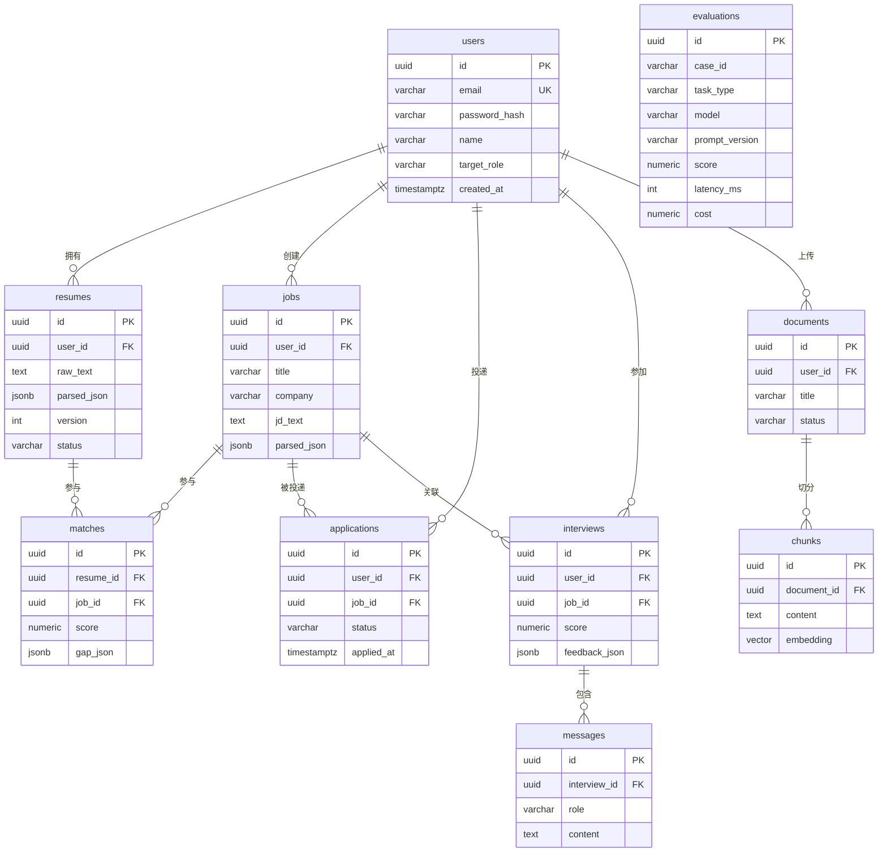

# AI Career Copilot · 数据库设计文档

> 版本：v0.1 ｜ 日期：2026-08-28 ｜ 作者：ZBC666
> 关联文件：`db/schema.sql`（可执行 DDL）｜ 可视化 ER 图：`docs/database.html`

---

## 一、设计原则

1. **先用 PostgreSQL 一个库搞定**：不引入多数据库/多组件，符合蓝图"避免炫技"原则
2. **JSONB 存结构化 AI 输出**：解析结果（resume/jd/match）结构多变，JSONB 灵活且可查询，避免频繁改表
3. **UUID 主键**：适合分布式/多端写入，避免自增 ID 暴露业务量
4. **用户数据隔离**：除 evaluations（评测表，跨用户）外，所有业务表都有 `user_id` 外键
5. **级联删除策略**：用户删除 → 其数据全部级联删除（隐私合规：用户可彻底删除自己数据）
6. **评测表独立**：evaluations 记录每次 AI 调用的质量与成本，支撑 Evaluation 体系

---

## 二、实体关系总览（ER）

---

## 三、表设计详解（10 张）

### 3.1 users 用户表

| 字段 | 类型 | 约束 | 说明 |
|---|---|---|---|
| id | UUID | PK, 默认 gen_random_uuid() | 主键 |
| email | VARCHAR(255) | NOT NULL, UNIQUE | 登录邮箱 |
| password_hash | VARCHAR(255) | NOT NULL | 密码哈希（bcrypt） |
| name | VARCHAR(100) | | 昵称 |
| target_role | VARCHAR(100) | | 目标岗位（默认匹配用） |
| created_at / updated_at | TIMESTAMPTZ | NOT NULL, 默认 now() | 时间戳 |

### 3.2 resumes 简历表

| 字段 | 类型 | 约束 | 说明 |
|---|---|---|---|
| id | UUID | PK | 主键 |
| user_id | UUID | FK→users, ON DELETE CASCADE | 所属用户 |
| file_url | TEXT | | 原始文件（PDF）地址 |
| raw_text | TEXT | | 抽取出的纯文本 |
| parsed_json | JSONB | | 结构化解析结果（教育/技能/项目） |
| version | INT | NOT NULL, 默认 1, UNIQUE(user_id,version) | 简历版本 |
| status | VARCHAR(20) | 默认 'parsing' | parsing/parsed/failed |
| created_at | TIMESTAMPTZ | | 时间戳 |

### 3.3 jobs 岗位/JD 表

| 字段 | 类型 | 约束 | 说明 |
|---|---|---|---|
| id | UUID | PK | 主键 |
| user_id | UUID | FK→users, CASCADE | 所属用户 |
| title / company | VARCHAR(200) | | 岗位名称 / 公司 |
| jd_text | TEXT | | JD 原文 |
| parsed_json | JSONB | | JD 解析（职责/技能/关键词） |
| source | VARCHAR(50) | 默认 'manual' | manual/upload |
| created_at | TIMESTAMPTZ | | 时间戳 |

### 3.4 matches 匹配结果表（核心）

| 字段 | 类型 | 约束 | 说明 |
|---|---|---|---|
| id | UUID | PK | 主键 |
| resume_id | UUID | FK→resumes, CASCADE | 关联简历 |
| job_id | UUID | FK→jobs, CASCADE | 关联岗位 |
| score | NUMERIC(5,2) | | 匹配总分 0~100 |
| dimension_json | JSONB | | 维度分 {skill, experience, education, expression} |
| strength_json | JSONB | | 优势清单 |
| gap_json | JSONB | | Gap 差距项（**带依据，可解释**） |
| suggestion | TEXT | | 行动建议 |
| created_at | TIMESTAMPTZ | | 时间戳 |
| | | UNIQUE(resume_id, job_id) | 同一简历对同一岗位只保留一次 |

### 3.5 applications 投递表

| 字段 | 类型 | 约束 | 说明 |
|---|---|---|---|
| id | UUID | PK | 主键 |
| user_id | UUID | FK→users, CASCADE | 用户 |
| job_id | UUID | FK→jobs, CASCADE | 岗位 |
| status | VARCHAR(20) | 默认 'applied' | applied/online_test/interview/offer/rejected |
| applied_at | TIMESTAMPTZ | 默认 now() | 投递时间 |
| note | TEXT | | 备注 |

### 3.6 interviews 模拟面试表

| 字段 | 类型 | 约束 | 说明 |
|---|---|---|---|
| id | UUID | PK | 主键 |
| user_id | UUID | FK→users, CASCADE | 用户 |
| job_id | UUID | FK→jobs, ON DELETE SET NULL | 关联岗位（可空） |
| score | NUMERIC(5,2) | | 综合评分 |
| feedback_json | JSONB | | 逐题反馈 + 能力评分 + 建议 |
| started_at / finished_at | TIMESTAMPTZ | | 起止时间 |

### 3.7 messages 面试对话表

| 字段 | 类型 | 约束 | 说明 |
|---|---|---|---|
| id | UUID | PK | 主键 |
| interview_id | UUID | FK→interviews, CASCADE | 所属面试 |
| role | VARCHAR(20) | NOT NULL | assistant/user |
| content | TEXT | NOT NULL | 消息内容 |
| created_at | TIMESTAMPTZ | | 时间戳 |

### 3.8 documents 知识库文档表

| 字段 | 类型 | 约束 | 说明 |
|---|---|---|---|
| id | UUID | PK | 主键 |
| user_id | UUID | FK→users, CASCADE | 用户 |
| title | VARCHAR(255) | | 标题 |
| source | VARCHAR(20) | 默认 'upload' | upload/builtin/manual |
| file_url | TEXT | | 文件地址 |
| status | VARCHAR(20) | 默认 'processing' | processing/indexed/failed |
| created_at | TIMESTAMPTZ | | 时间戳 |

### 3.9 chunks RAG 切片表（向量）

| 字段 | 类型 | 约束 | 说明 |
|---|---|---|---|
| id | UUID | PK | 主键 |
| document_id | UUID | FK→documents, CASCADE | 所属文档 |
| chunk_index | INT | 默认 0 | 切片序号 |
| content | TEXT | NOT NULL | 切片文本 |
| embedding | VECTOR(1536) | | **向量列（需 pgvector，第 13 步启用）** |

> 向量索引（第 13 步建）：`USING hnsw (embedding vector_cosine_ops)`，适合高维余弦相似检索。

### 3.10 evaluations AI 评测表

| 字段 | 类型 | 约束 | 说明 |
|---|---|---|---|
| id | UUID | PK | 主键 |
| case_id | VARCHAR(100) | NOT NULL | 测试用例 ID |
| task_type | VARCHAR(50) | NOT NULL | jd_parser/resume_parser/match/rag/interview |
| model | VARCHAR(100) | | 模型名 |
| prompt_version | VARCHAR(50) | | Prompt 版本 |
| input_hash | VARCHAR(64) | | 输入指纹 |
| output_json | JSONB | | 模型原始输出 |
| is_valid | BOOLEAN | | JSON Validity |
| score | NUMERIC(6,4) | | 指标得分 0~1 |
| latency_ms | INT | | 延迟 |
| cost | NUMERIC(10,6) | | Token 成本（美元） |
| created_at | TIMESTAMPTZ | | 时间戳 |

---

## 四、关键设计决策

| 决策 | 选择 | 理由 |
|---|---|---|
| 主键 | UUID | 多端/未来分布式友好，不暴露业务量 |
| AI 输出存储 | JSONB | 解析结果结构多变，JSONB 灵活且可索引查询 |
| 匹配结果 | 独立 matches 表 + JSONB 各维度 | 支持"同一简历多岗位"的历史沉淀 |
| 简历版本 | UNIQUE(user_id, version) | 版本管理，每版可回溯 |
| 投递状态 | 字符串枚举 | 简单直观，配合前端看板 |
| 面试岗位 | ON DELETE SET NULL | 岗位删除不连带删除面试记录（保留复盘数据） |
| 用户数据 | 全部 CASCADE | 隐私合规：用户可彻底删除 |
| 评测数据 | 独立表 + case_id | 支撑 Evaluation 体系的指标统计 |

---

## 五、索引策略

| 索引 | 表 | 用途 |
|---|---|---|
| idx_users_email | users | 登录查询 |
| idx_resumes_user | resumes | 用户简历列表 |
| idx_jobs_user | jobs | 用户岗位列表 |
| idx_matches_resume / job | matches | 匹配查询 |
| idx_apps_user(status) | applications | 投递看板/漏斗 |
| idx_interviews_user(started_at) | interviews | 面试历史 |
| idx_messages_interview(created_at) | messages | 对话记录 |
| idx_documents_user | documents | 知识库列表 |
| idx_evals_task(model,prompt,time) | evaluations | 评测统计 |
| HNSW(embedding) | chunks | **向量检索（第 13 步）** |

---

## 六、pgvector 说明（第 13 步启用）

- `chunks.embedding` 列类型为 `VECTOR(1536)`，需要安装 pgvector 扩展
- 本机 PostgreSQL 17 尚未安装 pgvector，当前验证时以 JSONB 占位
- 第 13 步（RAG）执行：
  1. 安装 pgvector（Windows 需编译或使用预编译包）
  2. `CREATE EXTENSION vector;`
  3. 执行 `db/schema.sql`（含 vector 列）
  4. 建立 HNSW 向量索引

---

## 七、验证记录

| 验证项 | 结果 |
|---|---|
| 10 张表创建 | ✅ 全部成功 |
| 11 个外键关系 | ✅ 全部正确 |
| 数据插入 | ✅ 1 user + 1 resume + 1 job + 1 interview |
| 级联删除 | ✅ 删 user 后 resume/job/interview 全清（0 残留） |
| 事务回滚 | ✅ 测试数据已清理，表保持空 |
| 数据库 | ✅ `ai_career_copilot`（PostgreSQL 17） |

> 说明：正式执行 `db/schema.sql` 前需先安装 pgvector（见第六节）。

---

## 八、给后续步骤的输入

- **第 7 步 FastAPI 后端**：按本设计的表/字段实现 SQLAlchemy Models
- **第 10 步岗位匹配**：matches 表存 score/gap_json，支撑"可解释匹配"
- **第 13 步 RAG**：documents + chunks 表 + 向量索引
- **第 15 步 Evaluation**：evaluations 表存储全部评测记录
- **第 16 步 Analytics**：applications/interviews 表支撑漏斗统计
